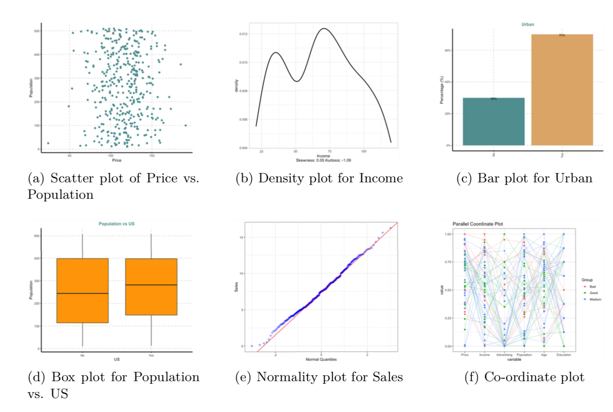
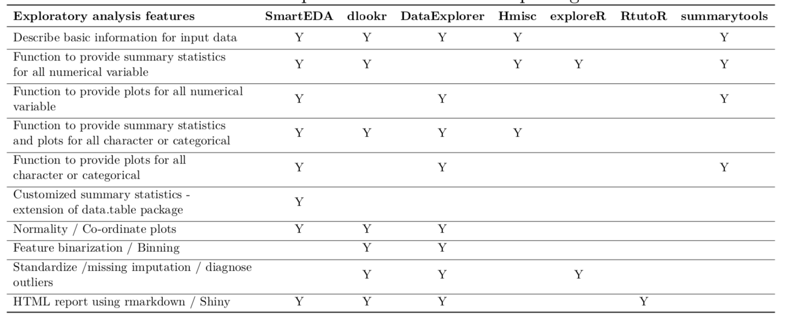

# Introduction: Exploratory Data Analysis

Nowadays, we see applications of Data Science almost everywhere. Some of the well highlighted aspects of data science are the various statistical and machine learning techniques applied for solving a problem. However, any data science activity starts with an Exploratory Data Analysis (EDA). The term "Exploratory Data Analysis" was coined by [@eda:1]. EDA can be defined as the art and science of performing initial investigation on the data by means of statistical and visualization techniques that can bring out the important aspects in the data that can be used for further analysis [@eda:1]. EDA puts an emphasis on hypothesis generation and pattern recognition from the raw data [@eda:8]. There have been many studies conducted on EDA reported in the Statistics literature.Some of earliest work done on Exploratory Data Analysis (EDA) including coining the term and defining some of the basic EDA techniques was done by [@eda:1]. However, many researchers have formulated different definitions of EDA over the years. One of the widely accepted definition is that "Exploratory data analysis isolates patterns and features of the data and reveals these forcefully to the analyst" [@eda:12].

@eda:4 introduced EDA in the context of data mining and resampling with focus on pattern recognition, cluster detection and variable selection. Over the years, EDA has been used various applications across different domains such as geoscience research [@eda:7], auditing [@eda:8], game-based assessments [@eda:9], clinical study groups [@eda:10] and more.

EDA can be categorized into Descriptive statistical techniques and graphical techniques [@eda:11]. The first category encompasses various univariate and multivariate statistical techniques whereas the second category comprises the various visualization techniques. Both of these techniques are used to explore the data, understand the patterns in the data, understand the existing relationships between the variables and most importantly, generate data drive insights that can be used by the business stakeholders. However, EDA requires a lot of manual effort and also a substantial amount of coding effort in statistical computing packages such as R @Venables+Ripley:2002. There is a huge need for automation of the EDA process and this motivated us to develop the SmartEDA package and come up with this paper. 


# Key Functionality

The SmartEDA package automatically select the variables and performs the related descriptive statistics. Moreover, it also analyzes information value, weight of evidence, custom tables, summary statistics and performs graphical techniques for both numeric and categorical variables. 

Some of the most important advantages of the SmartEDA package are that it can help in applying end to end EDA process without having to remember the different R package names, write lengthy R scripts, no manual effort required to prepare the EDA report and finally, automatically categorize the variables  into the right data type (viz. Character, Numeric, Factor and more) based on the input data. Thus, the main benefits of SmartEDA are in development time savings, less error percentage and reproducibility. 

Moreover, the SmartEDA package has customized options for the data.table package such as (1) Generate appropriate summary statistics depending on the data type, (2) Data reshaping using data.table.dcast(), (3) Filter rows/cases where conditions are true. Options to apply filters at variable level or complete data set like base subsetting and (4) Options to calculate measures of central tendency (like Mean, Median, Mode, etc.), measures of variance/dispersion (like Standard Deviation, Variance, etc.), Count, Proportions, Quantiles, IQR, Percentages of Shares (PS) for numerical data. Figure 1 summarizes the various functionalities of SmartEDA. 

{width="5in"}


# Illustration
We apply SmartEDA to generate insights on the sales of Child car seats at different locations. We will use the "Carseats" data available in the ISLR package [@pack:7] that contains 11 variables such as unit sales in each locations (Sales), price charged by competitors (CompPrice), community income level, (Income) population size in region (population), advertising budget (Advertising), price company charges for car seats in each site (Price), quality of shelving location (ShelveLoc), average age of local population (Age), education level at each location (Education), urban/rural location indicator (Urban) and US store/non-US store indicator (US).

We will now use SmartEDA for understanding the dimensions of the dataset, variable names, overall missing summary and data types of each variables.

```r
> library("SmartEDA")
> library("ISLR")
> Carseats <- ISLR::Carseats

> ExpData(data=Carseats,type=1)
# output
                                Descriptions       Obs
1                         Sample size (Nrow)       400
2                    No. of Variables (Ncol)        11
3                   No. of Numeric Variables         8
4                    No. of Factor Variables         3
5                      No. of Text Variables         0
6                   No. of Logical Variables         0
7                      No. of Date Variables         0
8   No. of Zero variance Variables (Uniform)         0
9      %. of Variables having complete cases 100% (11)
10 %. of Variables having <50% missing cases    0% (0)
11 %. of Variables having >50% missing cases    0% (0)
12 %. of Variables having >90% missing cases    0% (0)
```

Now let us look at the summary of the numerical/integer variables such as Advertising, Age, CompPrice, Income, Population, Price and Sales.

```r
> ExpNumStat(Carseats,by="A",gp=NULL,Qnt=NULL,MesofShape=2,
+            Outlier=FALSE,round=2,Nlim=10)
#Output- Summary of numerical variables of Carseats data
        Vname Group  TN nNeg nZero nPos NegInf PosInf NA_Value   ....
4 Advertising   All 400    0   144  256      0      0        0            
7         Age   All 400    0     0  400      0      0        0                
2   CompPrice   All 400    0     0  400      0      0        0              
3      Income   All 400    0     0  400      0      0        0              
5  Population   All 400    0     0  400      0      0        0             
6       Price   All 400    0     0  400      0      0        0              
1       Sales   All 400    0     1  399      0      0        0              
# ....  with 10 more columns such as max, mean, median, 
# ...   SD, CV, IQR, Skewness, Kurtosis and more.
```
We will now check for the summary of categorical variables namely, ShelveLoc, Urban and US.

```r
> ExpCTable(Carseats)
#Output- Summary of categorical variables of Carseats data
    Variable  Valid Frequency Percent CumPercent
1  ShelveLoc    Bad        96   24.00      24.00
2  ShelveLoc   Good        85   21.25      45.25
3  ShelveLoc Medium       219   54.75     100.00
4  ShelveLoc  TOTAL       400      NA         NA
5      Urban     No       118   29.50      29.50
6      Urban    Yes       282   70.50     100.00
7      Urban  TOTAL       400      NA         NA
8         US     No       142   35.50      35.50
9         US    Yes       258   64.50     100.00
10        US  TOTAL       400      NA         NA
```

We can visualize the different graphical representations using the SmartEDA package when applied on the "Carseats" dataset. Figure 2- (a), (b), (c), (d), (e) and (f) show the different graphical visualizations namely, Scatter plot, Density plot, Bar plot, Box plot, Normality plot and Co-ordinate plot respectively.

```r
# Scatter plot
> ExpNumViz(Carseats,gp="Price",nlim=4,fname=NULL,
+                    col=NULL,Page=NULL,sample=1) 
# Density plot
> ExpNumViz(Carseats,gp=NULL,nlim=10,sample=1) 
# Bar plot
> ExpCatViz(Carseats,gp=NULL,clim=5,margin=2,sample=1) 
# Box plot
> ExpNumViz(Carseats,gp="US",type=2,nlim=10,sample=1) 
# Normality plot
> ExpOutQQ(Carseats,nlim=10,sample=1)
# Co-ordinate plots
> ExpParcoord(Carseats,Group="ShelveLoc",Stsize=c(10,15,20),Nvar=
+     c("Price","Income","Advertising","Population","Age","Education"))
```

{width="5in"}


# Comparison with other R Packages 

Figure 9 compares the SmartEDA package [@smartEDA] with other similar packages available in CRAN for exploratory data analysis viz. dlookr [@pack:1], DataExplorer [@pack:2], Hmisc [@pack:3], exploreR [@pack:4], RtutoR [@pack:5] and summarytools [@pack:6]. The metric for evaluation is the availability of various desired features for performing an Exploratory data analysis such as (a) Describe basic information for input data, (b) Function to provide, (c) summary statistics for all numerical variables, (d) Function to provide plots for all numerical variables, (e) Function to provide summary statistics for all character or categorical variables, (f) Function to provide plots for all character or categorical variables, (g) Customized summary statistics- extension to data.table package, (h) Normality/ Co-ordinate plots, (i) Feature binarization/ binning, (j) Standardize/ missing imputation/ diagnose outliers and (k) HTML report using rmarkdown/ Shiny.

{width="5in"}


We can see in Figure 3 that the current version of SmartEDA has almost all the desired characteristics mentioned above except the points (h) and (i) i.e. normality plots and feature binning respectively. These two features would be incorporated in the next release and we are currently working on it. However, the unique and the strongest functionality provided by SmartEDA is point (f) i.e. extension to data.table package which none of the other packages provide. Thus, SmartEDA does add value given the importance and popularity of data.table among R users for analyzing large datasets. Figure 9 shows that SmartEDA is better than almost all the other packages available in CRAN. The closest competitor to SmartEDA seems to be the DataExplorer package but it doesn't possess the (b) and (f) features viz. Function to provide summary statistics for all numerical variables and extension to data.table package respectively. Also, another distinctive feature that SmartEDA has but none of the other similar packages have is the ability to export all the charts in a pdf.

# Conclusion

The contribution of this paper is in development of a new package in R i.e. SmartEDA for automated Exploratory Data Analysis. SmartEDA package helps in implementing the complete Exploratory Data Analysis just by running the function instead of writing lengthy R code. The users of SmartEDA can automate the entire EDA process on any dataset with easy to implements functions and export EDA reports that follows the industry and academia best practices. The SmartEDA can provide summary statistics along with graphical plots for both numerical and categorical variables. It also provides extension to data.table package which none of the other packages available in CRAN provides. Overall, the main benefits of SmartEDA are in development time savings, less error percentage and reproducibility.  As of July 2019, the SmartEDA package has more than 5000+ downloads, which indicates its acceptability and maturity in the Statistics and the Machine learning community.


# Availability

The software is distributed under a MIT + file LICENSE (Repository: CRAN) and is available from <https://github.com/daya6489/SmartEDA>.


# Acknowledgements

We would like to thank VMware and the Enterprise and Data Analytics (EDA) leadership for giving us the required infrastructure and support for this work. We are grateful to the R community for their acceptance and feedback to improve our package further.

# References


